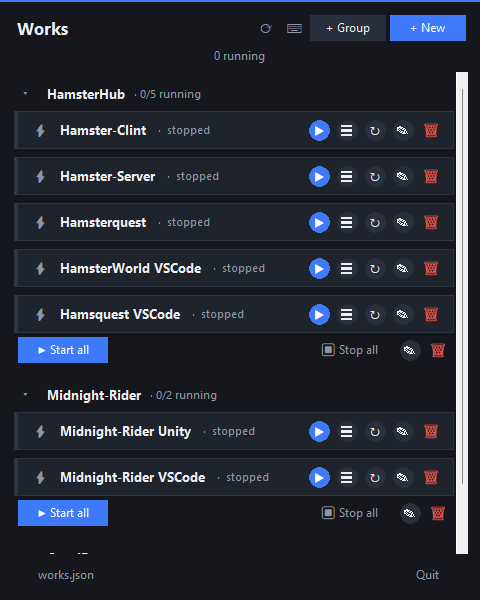
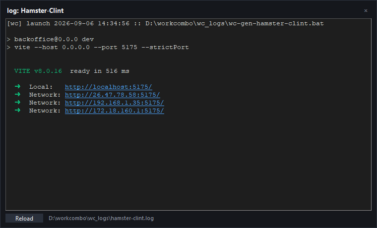
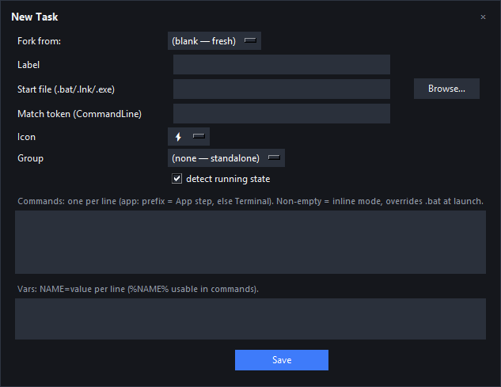

<p align="center">
  <h1 align="center">launchdeck</h1>
  <p align="center"><b>One screen to start, watch, and stop every dev server and app you run.</b></p>
  <p align="center">
    
    
    
  </p>
</p>

No consoles piling up. No forgotten background processes. No "which
terminal was the API server?" — every work launches **detached**, and the
deck shows what's actually alive right now, with a live log tail.

<p align="center">
  
  <br /><i>The deck: groups, live running state, per-row actions.</i>
</p>

| | |
|---|---|
|  |  |
| <i>Live color log tail with clickable links.</i> | <i>New-task editor: commands, vars, match token.</i> |

## Why not just more terminals?

- **1 work = 1 managed process tree.** Start/stop from one place instead
  of hunting windows.
- **Live detection, not wishful thinking.** The running dot comes from a
  real process scan every ~2 s — if the port is up, the dot is on.
- **Logs, not lost scrollback.** Each start truncates to a fresh per-work
  log with a `[deck] launch …` marker; the viewer follows in color with
  clickable URLs.
- **Safe kill by construction.** Down-only traversal (matches +
  descendants), a protected launcher chain, dry-run preview. It cannot
  take your editor, browser, or chat apps with it.
- **Optional Go accelerator** (`gowc/`) for sub-second scans on loaded
  machines; pure-Python fallback otherwise.

Two frontends, one shared core (`launchdeck_core.py`, zero dependencies):

| Entry | Role |
|-------|------|
| `launchdeck.bat` → `launchdeck.py` | Console TUI: Space select, Enter kill/launch |
| `launchdeck-tray.bat` → `launchdeck_dashboard.py` | Tray + dashboard twin (no console window) |

## Requirements

- Windows + Python 3 (stdlib only — nothing to `pip install`)
- Optional: Go toolchain to rebuild `gowc.exe`

## Quickstart

1. Clone, open the dashboard (`launchdeck-tray.bat`) or console (`launchdeck.bat`).
2. Add your works: dashboard editors (tasks / groups / settings) or edit
   `works.json` directly — one entry per work:

```json
{
  "id": "web-client",
  "label": "Web Client",
  "run": "detached",
  "vars": { "APPDIR": "D:\\examples\\web-client", "PORT": "5173" },
  "steps": [
    { "type": "terminal", "cmd": "cd /d \"%APPDIR%\"" },
    { "type": "terminal", "cmd": "npm run dev -- --port %PORT%" },
    { "type": "app", "cmd": "start \"\" \"%APPDIR%\\app.exe\"" }
  ],
  "match": "D:\\examples\\web-client",
  "detect": true,
  "icon": "⚡"
}
```

- `steps`: `terminal` lines run in order in a hidden shell;
  `app:` lines open GUI apps (`start "" ...`).
- `match`: **must appear verbatim in the real backend process's
  CommandLine** (e.g. the project dir for `node.exe`, not a window title).
  Detection and kill both key off it.
- `detect: false` = fire-and-forget (no running state shown).
- Global hotkey (`alt+w` by default) toggles the dashboard from anywhere.

## Safety (kill model)

Kills go **down-only**: matched seed processes + their descendants.
The launcher chain (scanner, launcher PID, all ancestors) is a protected
set that can never enter a kill list. Preview with dry-run before any real
kill. Details: `Docs/kill-safety.md`.

## Layout

| Path | Role |
|------|------|
| `works.json` | Manifest: `groups[]` + `works[]` (edit me) |
| `launchdeck_core.py` | Shared logic: manifest, detection, run/kill, registry. No UI |
| `launchdeck.py` / `launchdeck_dashboard.py` | The two frontends |
| `launchdeck_tray.py` | Tray primitives (ctypes only) |
| `gowc/` | Optional Go scan/kill accelerator (`go build -o ../gowc.exe .` inside) |
| `assets/` | README screenshots |
| `Docs/` | All knowledge: architecture, kill-safety, tray, verification |

Runtime files (`registry.json`, `launchdeck.settings.txt`, `wc_logs/`,
`works.local.json`) are local-only and git-ignored — never committed.

## Branches

- `main` — generic setup (this file's examples). For anyone to copy and use.

## Docs

Start at `AGENTS.md` (index) → `Docs/requirements.md`,
`Docs/architecture.md`, `Docs/verification.md`.
